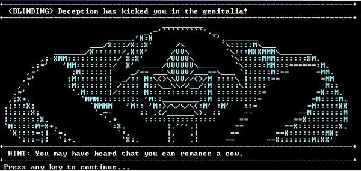
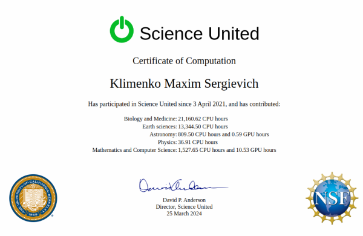
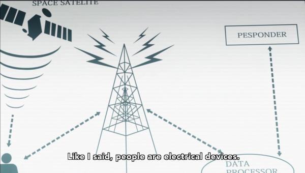

mksscryertower.quest
####################

:date: 2029-12-31 23:48
:authors: Klimenko Maxim Sergievich

####################

=====================
Arch Linux repository
=====================

Repository with builded packages for Arch GNU/Linux and pacman based distros.
In **/etc/pacman.conf** ::

  [repo.mksscryertower.quest]
  Server = https://repo.mksscryertower.quest/repo/x86_64/

Then run, from root ::

  pacman-key --recv-keys CF26478FD667CD54
  pacman-key --lsign-key CF26478FD667CD54
  pacman -Syyu

And back of this all:

=====
Pages
=====

`Home local network <{filename}/category/Home_local_network.rst>`_

`Workstation configuration <{filename}/category/Workstation_configuration.rst>`_

`Router configuration <{filename}/category/Router_configuration.rst>`_

`Self protection and Home power grid <{filename}/category/Self_protection_and_Home_power_grid.rst>`_

`Home DNS server <{filename}/category/Home_dns_server.rst>`_

`2FA for servers <{filename}/category/2FA_for_servers.rst>`_

`EMF and Human health <{filename}/category/Health_Effects_in_RF_Electromagnetic_fields.rst>`_

`EMF and Human health UA <{filename}/category/Health_Effects_in_RF_Electromagnetic_fields_ua.rst>`_

`Piracy on computers <{filename}/category/Piracy_on_computers.rst>`_

`Slavery in piracy groups, criminal groups and in cults <{filename}/category/Slavery_in_piracy_groups_criminal_groups_and_in_cults.rst>`_

`Slavery in piracy groups, criminal groups and in cults UA <{filename}/category/Slavery_in_piracy_groups_criminal_groups_and_in_cults_ua.rst>`_

`Human rights in Ukraine <{filename}/category/Human_rights_in_Ukraine.rst>`_

`Human rights in Ukraine UA <{filename}/category/Human_rights_in_Ukraine_ua.rst>`_

`Computer trace system <{filename}/category/Computer_trace_system.rst>`_

`Computer trace system UA <{filename}/category/Computer_trace_system_ua.rst>`_

`Artificial human life = existence (WIP) <{filename}/category/Artificial_human_life_and_existence.rst>`_

`Crimes with brain scanners, human detectors, other devices and me (WIP) <{filename}/category/Crimes_with_brain_scanners_human_detectors_other_devices_and_me.rst>`_

`Internet as a phenomenon <{filename}/category/Internet_as_a_phenomenon.rst>`_

`Brainwave entertainment (WIP) <{filename}/category/Brainwave_entertainment.rst>`_

`Radio frequency attacks from user side (WIP) <{filename}/category/Radio_frequency_attacks_from_user_side.rst>`_

`Dao of infosec <{filename}/category/Dao_of_infosec.rst>`_

`Dao of programming <{filename}/category/Dao_of_programming.rst>`_

`About <{filename}/category/About.rst>`_

#####################

1. The freedom of one ends where the freedom of another begins.

2. The ends do not justify the means.

3. Freedom of association and disassociation.

#####################

==========
Links Tree
==========

`My Github`_

.. _My Github: https://github.com/asciiscry3r

`My Instagram`_

.. _My Instagram: https://www.instagram.com/maximklimenkosergievich/

`My Tech`_

.. _My Tech: https://photos.app.goo.gl/Qp3hbLHZ2Ch7RH497

`My Link Tree`_

.. _My Link Tree: https://linktr.ee/_scry3r_

.. image:: images/animephosphen.png
	   :align: left

from chaos;head

date only for indexing
